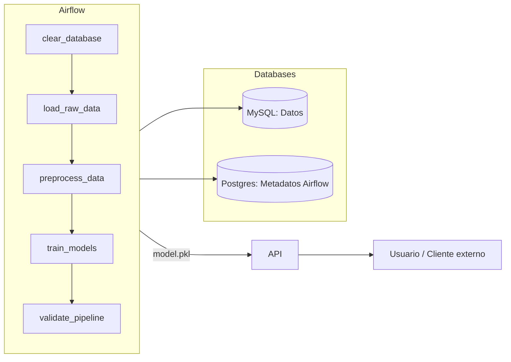

# 🐧 Taller 3 – Airflow con Docker Compose y API de Inferencia

## 📌 Descripción
Este taller implementa un **pipeline de Machine Learning para clasificación de pingüinos** usando **Airflow + Docker Compose**.  

El sistema incluye:  
- **Airflow**: DAG que limpia la BD, carga datos, preprocesa, entrena modelos y valida el pipeline.  
- **MySQL**: base de datos de datos (`penguins_raw`, `penguins_clean`).  
- **Postgres**: metadatos de Airflow.  
- **API FastAPI**: expone modelos entrenados para realizar inferencias.  

---

## 👥 Roles en el equipo
- **Persona 1**: Infraestructura y orquestación (Docker Compose, DBs, Airflow, API).  
- **Persona 2**: DAG de Airflow (pipeline completo).  
- **Persona 3**: API de inferencia (FastAPI).  

---

## 📂 Estructura del proyecto

```
Taller-3/
├─ airflow/                       # Configuración de Airflow
│  ├─ dags/                       # DAGs de Airflow (pipeline de pingüinos)
│  ├─ logs/                       # Logs de ejecución de Airflow
│  ├─ models/                     # Modelos sklearn (.pkl, metadata)
│  ├─ models_tf/                  # Modelos TensorFlow (.h5, SavedModel)
│  ├─ plugins/                    # Plugins personalizados
│  └─ requirements.txt            # Dependencias adicionales para DAGs
├─ api/                           # API de inferencia
│  ├─ __init__.py
│  ├─ api.py                      # API FastAPI (modelos sklearn)
│  ├─ api_tf.py                   # API FastAPI (modelos TensorFlow)
│  ├─ Dockerfile                  # Imagen de la API
│  └─ requirements.txt            # Dependencias de la API
├─ data/                          # Datos del proyecto
│  ├─ raw/                        # Datos crudos
│  └─ processed/                   # Datos procesados
├─ mysql/                         # Persistencia de MySQL
├─ venv/                          # Entorno virtual local (no versionar)
├─ .env                           # Variables de entorno (no versionar)
├─ .env.example                   # Ejemplo de configuración de entorno
├─ docker-compose.yml             # Orquestación de servicios
├─ README.md                      # Documentación principal
├─ requirements-local.txt         # Dependencias para pruebas locales
└─ .gitignore
```

---

## ⚙️ Requisitos
- Linux (máquina de la universidad).  
- **Docker** y **Docker Compose** instalados.  
- **Python 3.11** (para entorno virtual local).  

---

## 🐍 Configuración local con venv (opcional)
Para probar localmente sin Docker:

1. Crear entorno virtual:
```bash
python3 -m venv venv
source venv/bin/activate
```

2. Instalar dependencias:
```bash
pip install --upgrade pip
pip install -r requirements-local.txt
```

3. Entrenar modelos localmente:
```bash
python train_models.py --out ./airflow/models
```

4. Levantar la API localmente:
```bash
uvicorn api.api:app --reload --port 8000
```

---

## 🐳 Uso con Docker Compose
1. Copiar `.env.example` a `.env` y configurar credenciales (FERNET_KEY, MySQL, Postgres, Airflow admin).  

2. Construir e iniciar servicios:
```bash
docker compose up --build
```

3. Acceder a:
- Airflow UI → [http://localhost:8080](http://localhost:8080)  
- API FastAPI → [http://localhost:8000/docs](http://localhost:8000/docs)  

---

## 🚀 Flujo del DAG (`penguins_ml_pipeline`)
1. **clear_database** → limpia tablas `penguins_raw` y `penguins_clean`.  
2. **load_raw_data** → carga dataset crudo de pingüinos.  
3. **preprocess_data** → limpia nulos, codifica variables y genera metadata.  
4. **train_models** → entrena KNN, Random Forest y SVM; guarda el mejor como `model.pkl`.  
5. **validate_pipeline** → valida que todo se ejecutó correctamente.  

---
## ⚡Ejecución del DAG
- Se crea una nueva conexión `mysql_penguins` en `AirFlow > Admin > Connections`.
  
  

- Se dan permisos a la carpeta `models` en el proyecto de Airflow:

```bash
sudo mkdir -p ./airflow/models
sudo chown -R 50000:0 ./airflow/models
sudo chmod -R 775 ./airflow/models```

- Se visualizan los 5 pasos definidos en el **DAG** que conforman el pipeline.

  
  
- Las tablas que hacen parte del esquema.

  

- Las tablas vacias antes de la ejecución del **DAG**.

  

- **Se ejecuta el DAG**.
- Se observa la ejecución correcta del Pipeline.


- Tareas ejecutadas correctamente.


- Calendario de ejecución


- Las tablas ya muestran registros cargados.


- Las tablas ya muestran datos.


- Los modelos han sido actualizados.


---

## 📡 Endpoints de la API
- **GET /health** → estado de la API y modelos cargados.  
- **GET /models** → lista de modelos disponibles.  
- **POST /predict** → predicción con todos los modelos.  
- **POST /predict/{model_name}** → predicción con un modelo específico.  

Ejemplo:
```bash
curl -X POST "http://localhost:8000/predict"   -H "Content-Type: application/json"   -d '{"bill_length_mm":44.5,"bill_depth_mm":17.1,"flipper_length_mm":200,"body_mass_g":4200}'
```

---

## ✅ Checklist de validación
- [ ] Postgres y MySQL levantan y están `healthy`.  
- [ ] Airflow inicializa y crea usuario admin.  
- [ ] Airflow UI accesible en `:8080`.  
- [ ] API accesible en `:8000`.  
- [ ] DAG ejecuta y genera `model.pkl` en `airflow/models`.  
- [ ] API lista modelos y responde predicciones.  

---

## 📊 Diagrama (Mermaid)



---

## 🔧 Comandos útiles
- Ver logs de Airflow:
```bash
docker compose logs -f airflow-webserver
```

- Entrar al contenedor de MySQL:
```bash
docker compose exec mysql mysql -u root -p
```

- Entrar al contenedor de Airflow:
```bash
docker compose exec airflow-webserver bash
```

- Reconstruir imágenes y reiniciar:
```bash
docker compose up --build --force-recreate
```

---

👉 Con esta documentación, cualquier miembro del equipo puede levantar el Taller 3 en la **máquina Linux de la universidad** y validar todo el flujo end-to-end.
