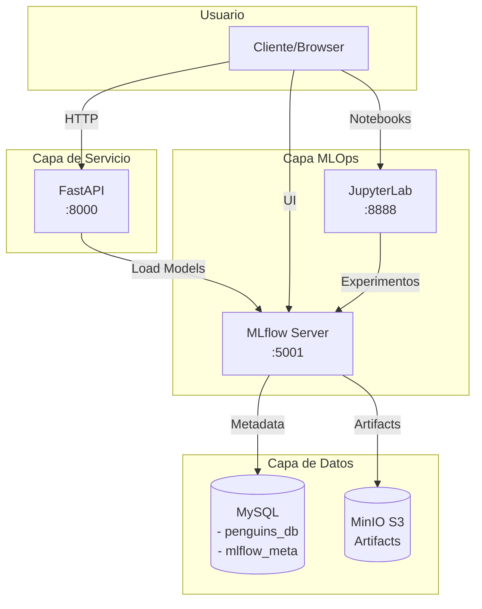

# 🚀 Taller MLflow - Pipeline MLOps Completo

## 📌 Descripción General

Este taller implementa un **pipeline completo de Machine Learning con MLOps** utilizando MLflow como plataforma central. El sistema permite entrenar modelos, realizar seguimiento de experimentos, registrar modelos y servir predicciones a través de una API REST.

### 🎯 Objetivos del Taller
- Implementar tracking de experimentos con MLflow
- Gestionar modelos con MLflow Model Registry
- Almacenar artefactos en MinIO (S3-compatible)
- Servir modelos en producción vía API REST
- Aplicar mejores prácticas de MLOps

## 🏗️ Arquitectura



## 🛠️ Componentes

### 1. **MinIO** (Puerto 9001)
- Almacenamiento S3-compatible para artefactos
- Bucket automático: `mlflows3`
- Credenciales: admin/supersecret

### 2. **MySQL** (Puerto 3306)
- Base de datos `penguins_db`: datos de entrenamiento
- Base de datos `mlflow_meta`: metadatos de MLflow
- Tablas: `penguins_raw`, `penguins_clean`, `model_metrics`

### 3. **MLflow** (Puerto 5001)
- Tracking de experimentos
- Model Registry
- Gestión de artefactos

### 4. **JupyterLab** (Puerto 8888)
- Desarrollo y experimentación
- Notebook con 25+ experimentos
- Token: mlflow2024

### 5. **API REST** (Puerto 8000)
- Inferencia en tiempo real
- Carga modelos desde MLflow Registry
- Documentación Swagger automática

## 📋 Pre-requisitos

- **Sistema Operativo**: Linux/macOS/Windows con WSL2
- **Docker**: versión 20.10+
- **Docker Compose**: versión 2.0+
- **Memoria RAM**: 8GB mínimo
- **Espacio en disco**: 10GB libre

## 🚀 Instalación y Uso

### 1. Clonar el repositorio
```bash
git clone https://github.com/tu-usuario/taller-mlflow.git
cd taller-mlflow
```

### 2. Configurar variables de entorno
```bash
cp .env.example .env
# Editar .env si deseas cambiar passwords (opcional)
```

### 3. Ejecutar el setup automático
```bash
chmod +x *.sh
./setup.sh
```

El script levantará todos los servicios automáticamente. Espera aproximadamente 2-3 minutos para la inicialización completa.

### 4. Verificar servicios
```bash
./test_services.sh
```

## 🔍 Flujo de Trabajo

### 1. Desarrollo de Experimentos
1. Acceder a JupyterLab: http://localhost:8888 (token: mlflow2024)
2. Abrir `work/experiments.ipynb`
3. Ejecutar todas las celdas (Cell → Run All)
4. El notebook realizará:
   - Carga de datos en MySQL
   - Preprocesamiento
   - 25+ experimentos con diferentes modelos
   - Registro del mejor modelo

### 2. Visualización en MLflow
1. Acceder a MLflow UI: http://localhost:5001
2. Ver experimento "penguins-classification"
3. Comparar métricas entre runs
4. Revisar el modelo en Model Registry

### 3. Servir Predicciones
```bash
# Endpoint de health
curl http://localhost:8000/health

# Listar modelos disponibles
curl http://localhost:8000/models

# Hacer predicción
curl -X POST "http://localhost:8000/predict" \
  -H "Content-Type: application/json" \
  -d '{
    "bill_length_mm": 44.5,
    "bill_depth_mm": 17.1,
    "flipper_length_mm": 200,
    "body_mass_g": 4200
  }'
```

## 📊 Dataset

El taller utiliza el dataset **Palmer Penguins**, que contiene mediciones de tres especies de pingüinos:
- **Adelie**
- **Chinstrap**
- **Gentoo**

Features utilizadas:
- `bill_length_mm`: Longitud del pico
- `bill_depth_mm`: Profundidad del pico
- `flipper_length_mm`: Longitud de la aleta
- `body_mass_g`: Masa corporal

## 🧪 Modelos Entrenados

El notebook entrena y compara los siguientes algoritmos:
1. **Random Forest** (5 configuraciones)
2. **K-Nearest Neighbors** (5 valores de k)
3. **Support Vector Machine** (5 kernels)
4. **XGBoost** (5 configuraciones)
5. **LightGBM** (5 configuraciones)

Total: 25+ experimentos con tracking completo de hiperparámetros y métricas.

## 📁 Estructura del Proyecto

```
taller-mlflow/
├── docker-compose.mlflow.yml    # Orquestación de servicios
├── .env                         # Variables de entorno
├── setup.sh                     # Script de instalación
├── test_services.sh            # Verificación de servicios
├── teardown.sh                 # Limpieza del ambiente
│
├── mysql/                      # Configuración MySQL
│   ├── init.sql               # Schema penguins_db
│   └── init-mlflow.sql        # Schema mlflow_meta
│
├── jupyter/                    # Configuración JupyterLab
│   ├── Dockerfile
│   └── requirements.txt
│
├── mlflow/                     # Configuración MLflow
│   └── Dockerfile
│
├── api/                        # API de inferencia
│   ├── api_mlflow.py          # FastAPI con MLflow
│   ├── Dockerfile.mlflow
│   └── requirements_mlflow.txt
│
├── notebooks/                  # Notebooks de experimentos
│   └── experiments.ipynb
│
└── data/                       # Datos del proyecto
    ├── raw/
    └── processed/
```

## 🔧 Comandos Útiles

### Gestión de servicios
```bash
# Ver logs de todos los servicios
docker compose -f docker-compose.mlflow.yml logs -f

# Ver logs de un servicio específico
docker logs -f mlflow-server

# Reiniciar un servicio
docker restart mlflow-server

# Detener todo
docker compose -f docker-compose.mlflow.yml down

# Detener y eliminar volúmenes (⚠️ borra datos)
docker compose -f docker-compose.mlflow.yml down -v
```

### Acceso a contenedores
```bash
# MySQL
docker exec -it mlflow-mysql mysql -u penguins -ppenguins123

# MinIO client
docker exec -it mlflow-minio mc ls myminio/

# JupyterLab terminal
docker exec -it mlflow-jupyter bash
```

## 🐛 Solución de Problemas

### Puerto en uso
Si aparece "bind: address already in use":
```bash
# Verificar qué usa el puerto (ej: 5001)
sudo lsof -i :5001
# Matar el proceso o cambiar puerto en docker-compose.mlflow.yml
```

### MySQL tarda en iniciar
MySQL puede tardar 1-2 minutos la primera vez. El setup.sh ya contempla esto.

### NoSuchBucket en MLflow
El bucket se crea automáticamente. Si hay problemas:
```bash
docker exec mlflow-minio mc mb myminio/mlflows3
docker restart mlflow-server
```

### Notebook con errores de conexión
Reiniciar el kernel y verificar las variables de entorno en la primera celda.

## 🚧 Mejoras Futuras

- [ ] Autenticación en MLflow y API
- [ ] CI/CD pipeline
- [ ] Monitoreo con Prometheus/Grafana
- [ ] Versionado automático de datasets
- [ ] A/B testing de modelos
- [ ] Drift detection

## 👥 Contribuciones

Las contribuciones son bienvenidas. Por favor:
1. Fork el proyecto
2. Crea una rama (`git checkout -b feature/nueva-caracteristica`)
3. Commit cambios (`git commit -am 'Agregar nueva característica'`)
4. Push a la rama (`git push origin feature/nueva-caracteristica`)
5. Crear Pull Request

## 📄 Licencia

Este proyecto está bajo la Licencia MIT. Ver archivo `LICENSE` para más detalles.

## 🙏 Agradecimientos

- Dataset Palmer Penguins por Allison Horst
- Comunidad MLflow
- Equipo de desarrollo MLOps

---

**Desarrollado para el curso de MLOps - 2024**